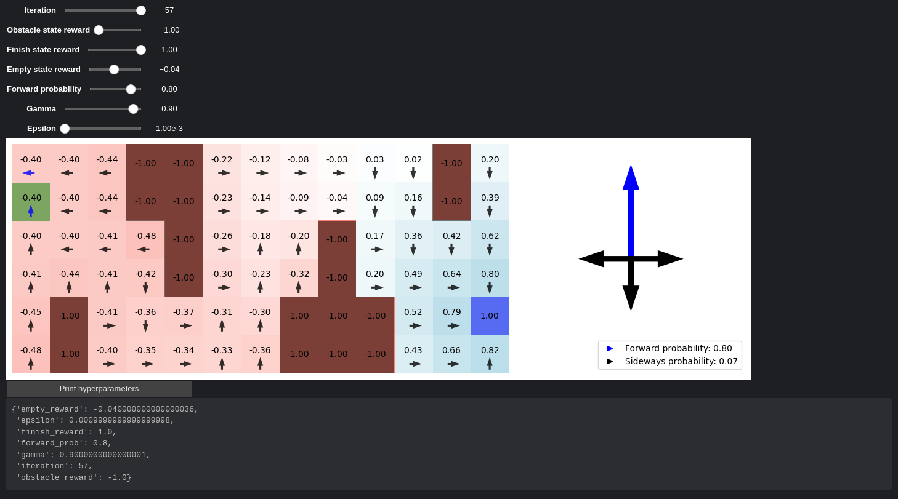

# Artificial Intelligence Foundations Practicals

Welcome to my repository for the Artificial Intelligence Foundations Practicals! This collection showcases various AI algorithms implemented to solve classic problems, with interactive visualizations and detailed explanations.

## Table of Contents

- [Introduction](#introduction)
- [Projects](#projects)
    - [Task 1: Maze Pathfinding with Systematic State Space Search Algorithms](#task-1-maze-pathfinding-with-systematic-state-space-search-algorithms)
    - [Task 2: N-Queens Problem Solved with Hill-Climbing Algorithm](#task-2-n-queens-problem-solved-with-hill-climbing-algorithm)
    - [Semestral Work: Pathfinding in a Cave with Obstacles Using Markov Decision Processes](#semestral-work-pathfinding-in-a-cave-with-obstacles-using-markov-decision-processes)
- [How to Run the Code](#how-to-run-the-code)
- [Dependencies](#dependencies)
- [File Structure](#file-structure)
- [References](#references)

## Introduction

Dive into the world of artificial intelligence with these practical implementations of search algorithms and problem-solving techniques. From navigating mazes to placing queens on a chessboard, and guiding a cautious drone through a perilous cave, this repository demonstrates the power and versatility of AI algorithms.

## Projects

### Task 1: Maze Pathfinding with Systematic State Space Search Algorithms

**Folder**: [task01](task01/)

Implementing five methods of systematic state space search to find a path through a maze:

1. **Random Search**
2. **Depth-First Search (DFS)**
3. **Breadth-First Search (BFS)**
4. **Greedy Search**
5. **A\* Algorithm**

Each algorithm reads a maze from a text file, encodes it appropriately, visualizes the search process using Pygame, and outputs the path length and number of nodes expanded.

**Highlights**:

- Visual step-by-step execution of each algorithm.
- Comparison of different search strategies.
- Interactive code with Jupyter Notebook.

**See more**: [Task 1 README](task01/README.md)

### Task 2: N-Queens Problem Solved with Hill-Climbing Algorithm

**Folder**: [task02](task02/)

Solving the N-Queens problem using the Hill-Climbing algorithm with random restarts and sideways moves. The goal is to place N queens on an N×N chessboard so that no two queens threaten each other.

**Features**:

- Flexible for any N (try N=8, N=20, or even N=100).
- Visualization of initial and final board states using Pygame.
- Adjustable parameters like depth of search and number of sideway moves.

**Visuals**:

- Initial and final states displayed side by side.
- Queens represented by colored circles on the chessboard.

**See more**: [Task 2 README](task02/README.md)

### Semestral Work: Pathfinding in a Cave with Obstacles Using Markov Decision Processes

**Folder**: [semestral_work](semestral_work/)

Navigating a cautious drone through a cave filled with dangerous stalagmites and stalactites using Markov Decision Processes (MDPs) and the Value Iteration algorithm.

**Key Aspects**:

- **MDP Modeling**: States, actions, transition models, and rewards.
- **Value Iteration**: Computing the optimal policy for the drone.
- **Interactive Visualization**: Adjust hyperparameters like discount factor (gamma), forward probability, and rewards to see how the drone's behavior changes.

**Interactive Plot Example**:



**Explore**:

- How different parameters affect the drone's path.
- The balance between safety and efficiency.
- The impact of uncertainty in movement.

**See more**: [Semestral Work README](semestral_work/README.md)

## How to Run the Code

For each project:

1. **Clone the Repository**

   ```bash
   git clone https://github.com/nickobard/ZUM-Artificial-Intelligence-Foundations-Practicals.git
   cd ZUM-Artificial-Intelligence-Foundations-Practicals
   ```

2. **Navigate to the Project Folder**

   For example, to run Task 1:

   ```bash
   cd task01
   ```

3. **Install Dependencies**

   Ensure you have Python 3.x installed. Install the required packages:

   ```bash
   pip install -r requirements.txt
   ```

   *Note*: Some projects may have their own `requirements.txt` file or instructions how to install deps in README files.

4. **Run the Jupyter Notebook**

   ```bash
   jupyter notebook task01.ipynb
   ```

5. **Execute the Cells**

   Run the notebook cells sequentially to see the implementations and visualizations.

6. **Interact with the Visualizations**

    - For interactive plots, adjust sliders and parameters as desired.
    - For Pygame visualizations, follow on-screen instructions.

## Dependencies

- Python 3.x
- Jupyter Notebook
- Pygame
- NumPy
- Other packages as listed in each project's `requirements.txt`

## File Structure

```
.
├── environment.yml
├── .gitignore
├── semestral_work
│   ├── images
│   │   └── interactive_plot.png
│   ├── mdp.py
│   ├── notebook.py
│   ├── README.md
│   ├── report.pdf
│   ├── requirements.txt
│   ├── semestral_work.ipynb
│   ├── utils.py
│   └── visualization.py
├── task01
│   ├── dataset
│   │   ├── evaluation
│   │   │   ├── 00_11_11_1550177690.txt
│   │   │   ├── 01_71_51_156.txt
│   │   │   └── 02_71_51_1552235384.txt
│   │   └── test
│   │       ├── 0.txt
│   │       ├── 114.txt
│   │       ├── 220.txt
│   │       ├── ...
│   ├── images
│   │   ├── bfs_algorithm.png
│   │   ├── dfs_algorithm.png
│   │   ├── random_search.png
│   │   └── visualizations
│   │       ├── a_star
│   │       ├── bfs
│   │       ├── dfs
│   │       ├── greedy_search
│   │       └── random_search
│   ├── README.md
│   ├── roboto.ttf
│   └── task01.ipynb
└── task02
    ├── images
    │   ├── example1.png
    │   ├── example2.png
    │   └── example3.png
    ├── README.md
    ├── roboto.ttf
    └── task02.ipynb
```

## References

- **Artificial Intelligence: A Modern Approach** by Stuart Russell and Peter Norvig
- **AIMA Python Code**: [GitHub Repository](https://github.com/aimacode/aima-python)
- **Pygame Documentation**: [Pygame](https://www.pygame.org/docs/)

---

**Note**: For detailed instructions and explanations, please refer to the README.md files in each project folder.

---

Feel free to explore, experiment, and learn from these implementations. If you have any questions or need further assistance, don't hesitate to reach out!