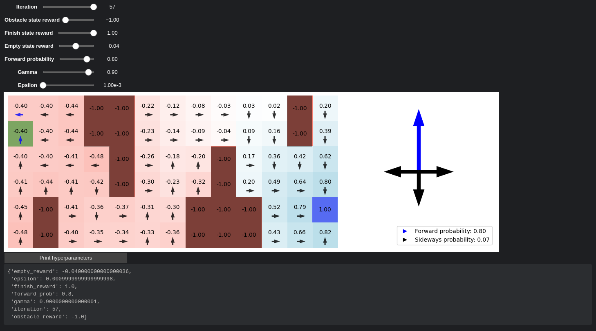

# Pathfinding in a Cave with Obstacles Using Markov Decision Processes

This project implements a solution to a pathfinding problem where a drone must navigate through a cave filled with obstacles (stalagmites and stalactites) to safely reach a finish point. The environment is modeled as a **Markov Decision Process (MDP)**, and the **Value Iteration** algorithm is used to find the optimal policy. The solution includes interactive visualizations to demonstrate the effects of different hyperparameters on the agent's behavior.

## Table of Contents

- [Task Description](#task-description)
- [Solution Overview](#solution-overview)
    - [MDP Classes](#mdp-classes)
    - [Value Iteration Algorithm](#value-iteration-algorithm)
    - [Results and Visualizations](#results-and-visualizations)
- [File Structure](#file-structure)
- [How to Run the Code](#how-to-run-the-code)
- [Dependencies](#dependencies)
- [References](#references)

## Task Description

The task involves planning a safe path for a cautious drone through a cave filled with obstacles. The drone must avoid collisions and prefers to keep a safe distance from obstacles. The environment is fully observable, and the drone always knows its exact position. The goal is to find a path that balances safety and speed, reaching the finish point as quickly as possible without getting too close to obstacles.

## Solution Overview

### MDP Classes

The problem is modeled as a **Markov Decision Process (MDP)**, which includes:

- **States**: Each possible position of the drone in the cave grid.
- **Actions**: Possible movements (e.g., up, down, left, right).
- **Transition Model**: Probabilities of moving to a new state given a current state and action, accounting for uncertainties (e.g., slipping to adjacent cells).
- **Rewards**: Numerical values assigned to transitions, encouraging reaching the goal and discouraging collisions or getting too close to obstacles.

The `MDP` base class encapsulates the generic MDP components, while the `GridMDP` class extends it to handle 2D grid environments like the cave.

### Value Iteration Algorithm

The **Value Iteration** algorithm is used to compute the optimal policy for the MDP. It iteratively updates the utility values of each state based on the Bellman equation:

$$
U_{i+1}(s) = R(s) + \gamma \max_{a \in A(s)} \sum_{s'} P(s' | s, a) U_i(s')
$$

Where:

- $ U(s) $: Utility of state $ s $.
- $ R(s) $: Reward for state $ s $.
- $ \gamma $: Discount factor (how much future rewards are cons$ere$.
- $ A(s) $: Set of actions available in state $ s $.
- $ P(s' | s, a) $: Transition probability from state $ s $ to $ s' $ given action $ a $.

The algorithm continues until the utilities converge within a specified threshold (epsilon).

### Results and Visualizations

The solution provides interactive visualizations to explore how different hyperparameters affect the agent's behavior:

- **Grid Visualization**: Shows the cave grid with obstacles, start and finish points, utilities of states, and the optimal policy (best actions).
- **Action Probability Distribution**: Visualizes the probabilities associated with each action, reflecting the drone's uncertainty in movement.

An example of the interactive plot:



#### Hyperparameters:

- **Gamma ($ \gamma $)**: Discount factor determining how much future rewards are considered.
- **Epsilon**: Threshold for utility convergence.
- **Forward Probability**: Probability that the drone moves in the intended direction; accounts for movement uncertainty.
- **Rewards**:
    - **Empty Cell Reward**: Penalty or reward for moving through empty cells.
    - **Obstacle Reward**: Penalty for hitting an obstacle.
    - **Finish Reward**: Reward for reaching the goal.

By adjusting these hyperparameters, we can observe different behaviors:

- **High Gamma**: The drone considers long-term rewards, willing to take risks to reach the goal.
- **Low Forward Probability**: Increases uncertainty in movement, causing the drone to prefer safer paths.
- **Negative Empty Cell Reward**: Encourages the drone to reach the goal faster to avoid penalties for staying in the cave.

#### Example Scenarios:

- **Cautious Drone**: With low forward probability and negative empty cell rewards, the drone avoids obstacles and prefers safer routes.
- **Risk-Taking Drone**: With high gamma and low penalties, the drone takes the shortest path, even if it brings it close to obstacles.

## File Structure

```
.
├── images
│   └── interactive_plot.png
├── mdp.py
├── notebook.py
├── report.pdf
├── requirements.txt
├── semestral_work.ipynb
├── utils.py
└── visualization.py
```

- `semestral_work.ipynb`: The Jupyter Notebook containing the solution and interactive visualizations.
- `mdp.py`: Contains the `MDP` and `GridMDP` classes for modeling the environment.
- `visualization.py`: Functions for visualizing the grid and interactive plots.
- `utils.py`: Utility functions, including grid definitions.
- `notebook.py`: Helper functions for displaying code in the notebook.
- `report.pdf`: Detailed report of the project.
- `requirements.txt`: List of required Python packages.

## How to Run the Code

1. **Clone the Repository**

   ```bash
   git clone https://github.com/nickobard/ZUM-Artificial-Intelligence-Foundations-Practicals/tree/master
   cd semestral_work
   ```

2. **Install Dependencies**

   Ensure you have Python 3.x installed. Install the required packages:

   ```bash
   pip install -r requirements.txt
   ```

3. **Run the Jupyter Notebook**

   ```bash
   jupyter notebook semestral_work.ipynb
   ```

4. **Interact with the Notebook**

    - Run the cells sequentially to set up the environment.
    - Use the interactive sliders to adjust hyperparameters and observe the changes in the visualizations.
    - Click the "Print Hyperparameters" button to display print current settings.

## Dependencies

- Python 3.x
- Jupyter Notebook
- Required Python packages listed in `requirements.txt`

## References

- **Artificial Intelligence: A Modern Approach (Fourth Edition)** by Stuart Russell & Peter Norvig
- **AIMA Python Code**: [GitHub Repository](https://github.com/aimacode/aima-python)

---

**Note**: The interactive visualizations require Jupyter Notebook to be viewed properly. Ensure all dependencies are installed, and the notebook is run in an environment that supports interactive widgets.

---

If you have any questions or need further assistance, feel free to contact me.