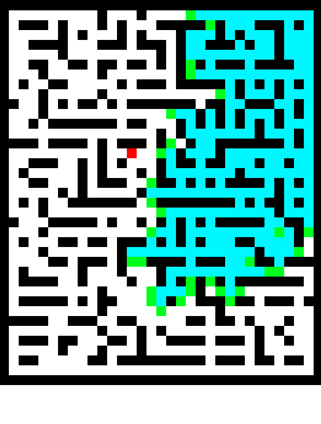
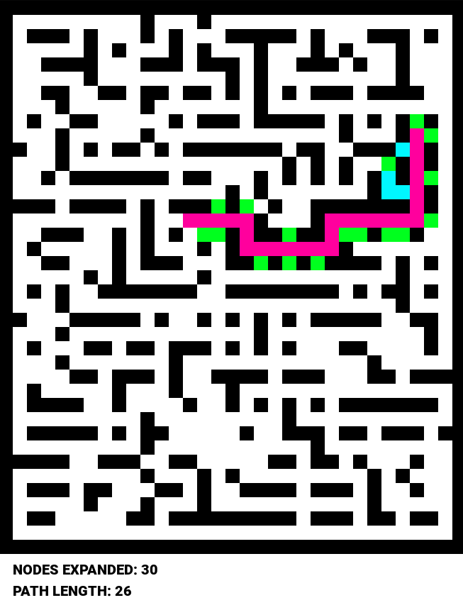

# Maze Pathfinding with Systematic State Space Search Algorithms

This project implements five methods of systematic state space search to solve the problem of finding a path in a maze. The algorithms are visualized using Pygame to demonstrate their operation in animation.

## Table of Contents

- [Task Description](#task-description)
- [Solution Overview](#solution-overview)
    - [Reading Input](#reading-input)
    - [Maze Representation](#maze-representation)
    - [Visualization](#visualization)
    - [Implemented Algorithms](#implemented-algorithms)
        - [Random Search](#1-random-search)
        - [Breadth-First Search (BFS)](#2-breadth-first-search-bfs)
        - [Depth-First Search (DFS)](#3-depth-first-search-dfs)
        - [Greedy Search](#4-greedy-search)
        - [A* Algorithm](#5-a-algorithm)
- [Results](#results)
- [File Structure](#file-structure)
- [How to Run the Code](#how-to-run-the-code)
- [Dependencies](#dependencies)
- [References](#references)

## Task Description

The goal is to implement and demonstrate the following five methods of systematic state space search for finding a path in a maze:

1. **Random Search**
2. **Depth-First Search (DFS)**
3. **Breadth-First Search (BFS)**
4. **Greedy Search**
5. **A\* Algorithm**

Each algorithm should:

- Read the maze from a text file.
- Encode the maze problem appropriately for state space search.
- Provide a simple visualization showing the algorithm's operation, including expanded nodes and the final path.
- Output the length of the found path and the number of nodes expanded.

The maze is represented as a text file with the following format:

- `'X'` represents walls.
- `' '` (space) represents free passage.
- Positions are given in Cartesian coordinates, with the origin `(0, 0)` at the top-left corner.
- Start and end positions are specified at the end of the file.

Example of a maze file:

```
XXXXXXXXXXXXX
X           X
X  XXXXXXX  X
X     X     X
X X X X XXX X
X X         X
XX  X XXXXX X
X   X       X
X X X XXX XXX
X           X
X XXX X   X X
X           X
XXXXXXXXXXXXX
start 1, 7
end 5, 3
```

## Solution Overview

### Reading Input

The maze is read from a text file specified by the user. The code parses the maze layout and extracts the start and end coordinates.

```python
file_path = "dataset/test/26.txt"
with open(file_path) as file:
    lines = file.readlines()

lines = [line.strip() for line in lines]

labyrinth = lines[:-2]
start_coords = lines[-2]
end_coords = lines[-1]
```

### Maze Representation

The maze is converted into a graph where each free cell is a node, and edges connect neighboring free cells. Walls are stored separately for visualization purposes.

```python
graph = {}
WALLS = []
for y in range(labyrinth_height):
    for x in range(labyrinth_width):
        if labyrinth[y][x] == "X":
            WALLS.append((x, y))
            continue
        edges = []
        for delta_x, delta_y in [(1, 0), (-1, 0), (0, 1), (0, -1)]:
            neigh_x, neigh_y = x + delta_x, y + delta_y
            if labyrinth[neigh_y][neigh_x] == " ":
                edges.append((neigh_x, neigh_y))
        graph[(x, y)] = edges
```

### Visualization

Pygame is used for visualization. Each algorithm's progress is displayed step-by-step, showing open nodes, closed nodes, and the final path.

Visualization settings:

- **Cell Size**: 20 pixels
- **Colors**:
    - Walls: Black
    - Start: Blue
    - End: Red
    - Open Nodes: Green
    - Closed Nodes: Cyan
    - Path: Purple

```python
CELL_SIZE = 20
WALL_COLOR = (0, 0, 0)
START_COLOR = (0, 26, 255)
END_COLOR = (255, 0, 0)
OPEN_COLOR = (0, 255, 30)
CLOSED_COLOR = (0, 247, 255)
PATH_COLOR = (255, 0, 157)
```

### Implemented Algorithms

#### 1. Random Search

Randomly selects a node from the open set and explores its neighbors until the end is found.

```python
def random_search(graph, start, end, surface):
    predecessors = dict()
    opened = set()
    opened.add(start)
    expanded = set()
    while len(opened) != 0:
        current = random.choice(list(opened))
        if current == end:
            draw_cell(surface, current, CLOSED_COLOR, sleep=False)
            return predecessors, len(expanded)
        # ... (rest of the code)
```

#### 2. Breadth-First Search (BFS)

Explores all neighbors at the present depth before moving to nodes at the next depth level.

```python
def bfs_search(graph, start, end, surface):
    predecessors = dict()
    opened = set()
    opened.add(start)
    front = []
    front.append(start)
    expanded = set()
    while len(front) != 0:
        current = front.pop(0)
        if current == end:
            draw_cell(surface, current, CLOSED_COLOR, sleep=False)
            return predecessors, len(expanded)
        # ... (rest of the code)
```

#### 3. Depth-First Search (DFS)

Explores as far as possible along each branch before backtracking.

```python
def dfs_search(graph, start, end, surface):
    predecessors = dict()
    opened = set()
    opened.add(start)
    stack = []
    stack.append(start)
    expanded = set()
    while len(stack) != 0:
        current = stack.pop(-1)
        if current == end:
            draw_cell(surface, current, CLOSED_COLOR, sleep=False)
            return predecessors, len(expanded)
        # ... (rest of the code)
```

#### 4. Greedy Search

Selects the next node based on a heuristic that estimates the cost to reach the goal.

```python
def greedy_search(graph, start, end, surface):
    def manhattan_distance_heuristic(v1, v2):
        return abs(v1[0] - v2[0]) + abs(v1[1] - v2[1])
    # ...
    while not pq.empty():
        priority, current = pq.get()
        if current == end:
            draw_cell(surface, current, CLOSED_COLOR, sleep=False)
            return predecessors, len(expanded)
        # ... (rest of the code)
```

#### 5. A\* Algorithm

Combines the cost to reach the node and the estimated cost from the node to the goal.

```python
def a_star_search(graph, start, end, surface):
    def manhattan_distance_heuristic(v1, v2):
        return abs(v1[0] - v2[0]) + abs(v1[1] - v2[1])
    # ...
    while len(opened) != 0:
        current, priority = min(opened.items(), key=lambda item: item[1])
        if current == end:
            draw_cell(surface, current, CLOSED_COLOR, sleep=False)
            return predecessors, len(expanded)
        # ... (rest of the code)
```

## Results

### Random Search

**Start:**


**Progress:**



**Finish:**


---

### Breadth-First Search (BFS)

**Start:**


**Progress:**


**Finish:**


---

### Depth-First Search (DFS)

**Start:**


**Progress:**


**Finish:**


---

### Greedy Search

**Start:**


**Progress:**


**Finish:**



---

### A\* Algorithm

**Start:**


**Progress:**


**Finish:**


## File Structure

```
.
├── dataset
│   ├── evaluation
│   │   ├── 00_11_11_1550177690.txt
│   │   ├── 01_71_51_156.txt
│   │   └── 02_71_51_1552235384.txt
│   └── test
│       ├── 0.txt
│       ├── 114.txt
│       ├── 220.txt
│       ├── 26.txt
│       ├── 332.txt
│       ├── 36.txt
│       ├── 42.txt
│       ├── 4.txt
│       ├── 6.txt
│       ├── 72.txt
│       └── 84.txt
├── images
│   ├── bfs_algorithm.png
│   ├── dfs_algorithm.png
│   ├── random_search.png
│   └── visualizations
│       ├── a_star
│       │   ├── a_star_almost.png
│       │   ├── a_star_finish.png
│       │   └── a_star_start.png
│       ├── bfs
│       │   ├── bfs_almost.png
│       │   ├── bfs_finish.png
│       │   └── bfs_start.png
│       ├── dfs
│       │   ├── dfs_almost.png
│       │   ├── dfs_finish.png
│       │   └── dfs_start.png
│       ├── greedy_search
│       │   ├── greedy_search_almost.png
│       │   ├── greedy_search_finish.png
│       │   └── greedy_search_start.png
│       └── random_search
│           ├── random_search_almost.png
│           ├── random_search_finish.png
│           └── random_search_start.png
├── roboto.ttf
└── task01.ipynb
```

## How to Run the Code

1. **Clone the Repository**

   ```bash
   git clone https://github.com/yourusername/maze-pathfinding.git
   cd maze-pathfinding
   ```

2. **Install Dependencies**

   Ensure you have Python 3.x installed. Install the required packages:

   ```bash
   pip install pygame
   ```

3. **Run the Jupyter Notebook**

   ```bash
   jupyter notebook task01.ipynb
   ```

4. **Select a Maze File**

   Modify the `file_path` variable in the notebook to select the desired maze file.

   ```python
   file_path = "dataset/test/26.txt"
   ```

5. **Execute the Cells**

   Run the notebook cells sequentially to see the visualizations for each algorithm.

## Dependencies

- Python 3.x
- Pygame
- Jupyter Notebook

## References

- **Artificial Intelligence: A Modern Approach** by Stuart Russell and Peter Norvig