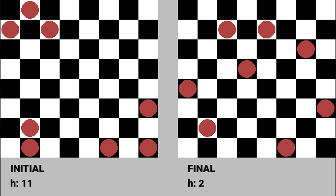

# N-Queens Problem Solved with Hill-Climbing Algorithm

This project implements the N-Queens problem using the Hill-Climbing algorithm, a method of non-systematic state space search. The solution includes visualization using Pygame to illustrate the algorithm's operation.

## Table of Contents

- [Task Description](#task-description)
- [Solution Overview](#solution-overview)
    - [1. Problem Encoding](#1-problem-encoding)
    - [2. Objective Function](#2-objective-function)
    - [3. Neighbor States Definition](#3-neighbor-states-definition)
    - [4. Enumeration of Neighbor States](#4-enumeration-of-neighbor-states)
    - [5. Hill-Climbing Implementation](#5-hill-climbing-implementation)
    - [6. Visualization](#6-visualization)
- [Results](#results)
- [File Structure](#file-structure)
- [How to Run the Code](#how-to-run-the-code)
- [Dependencies](#dependencies)
- [References](#references)

## Task Description

The goal is to implement one method of non-systematic state space search to solve the **N-Queens problem**. Specifically, the Hill-Climbing algorithm is used.

### N-Queens Problem

Place **N** queens on an **N×N** chessboard such that no two queens threaten each other. A queen can attack another queen if they are on the same row, column, or diagonal.

### Hill-Climbing Algorithm

Hill-Climbing is an iterative algorithm that starts with an arbitrary solution and makes incremental changes to improve it, aiming to find a local optimum.

## Solution Overview

### 1. Problem Encoding

The N-Queens problem is encoded as a set of queen positions on an **N×N** board. Each queen's position is represented as a tuple `(row, column)`. The initial state is generated by placing **N** queens at random positions on the board.

```python
def create_initiate_state(n: int):
    all_possible_positions = [(i, j) for i in range(n) for j in range(n)]
    sample = random.sample(all_possible_positions, n)
    return set(sample)
```

Visualization of an initial state for **N = 5**:

```python
matrix_view = get_matrix_view(initial_state, 5)
display(matrix_view)
```


### 2. Objective Function

The objective function calculates the number of pairs of queens that are attacking each other. Lower values are better, with zero indicating a solution where no queens attack each other.

```python
def heuristic(queens: set):
    h = 0
    n = len(queens)
    remaining_queens: set = queens.copy()
    while len(remaining_queens) > 0:
        queen = remaining_queens.pop()
        neighbors = get_queen_moves(queen, n, depth=n)
        h += len(neighbors & remaining_queens)
    return h
```

### 3. Neighbor States Definition

Neighbor states are generated by moving one queen to a new position where it does not attack any other queen directly. The possible moves are determined by the queen's movement rules in chess, considering obstacles (other queens).

```python
def get_all_neighbor_states(queens: set, depth: int):
    neighbors_states = list()
    for queen in queens:
        remaining_queens = queens - {queen}
        neighbors = get_queen_moves(queen, n, depth, remaining_queens)
        for neighbor in neighbors:
            neighbors_states.append(remaining_queens | {neighbor})
    return neighbors_states
```

### 4. Enumeration of Neighbor States

The number of neighbor states depends on the depth of queen movements (how far a queen can move). For depth ranging from 1 to N, the number of neighbor states is calculated.

```python
enumerate_neighbor_states(initial_state, depth)
```

### 5. Hill-Climbing Implementation

The Hill-Climbing algorithm is implemented with the option for random restarts and sideways moves to escape local minima.

```python
def hill_climbing(initial_state, depth: int, side_way_moves: int = 0):
    # Implementation details...
```

The main function to solve the N-Queens problem:

```python
def n_queens(n: int, restarts: int = 0, side_way_moves: int = 0, depth: int | None = None, rd_seed: int | None = None):
    # Implementation details...
```

### 6. Visualization

Pygame is used to visualize the initial and final states of the board after applying the Hill-Climbing algorithm. The chessboard is displayed with queens represented by colored circles.

Visualization settings:

- **Tile Size**: 40 pixels
- **Colors**:
    - Black Tiles: Black
    - White Tiles: White
    - Queens: Red

```python
def run_visualization(n: int, side_way_moves: int = 0, depth: int | None = None, rd_seed: int | None = None):
    # Visualization implementation...
```

## Results

### Example 1

For **N = 8**, with **side_way_moves = 5**, and a random seed:

```python
n = 8
side_way_moves = 5
depth = None
rd_seed = 42

run_visualization(n, side_way_moves, depth, rd_seed)
```




The algorithm doesn't find a solution where no queens attack each ather after (heuristic value **2**).

### Example 2

With a different random seed:

```python
rd_seed = 43
run_visualization(n, side_way_moves, depth, rd_seed)
```


The algorithm finds a solution where no queens attack each other (heuristic value **0**).

## File Structure

```
.
├── images
│   ├── example1.png
│   ├── example2.png
│   └── example3.png
├── roboto.ttf
└── task02.ipynb
```

## How to Run the Code

1. **Clone the Repository**

   ```bash
   git clone git@github.com:nickobard/ZUM-Artificial-Intelligence-Foundations-Practicals.git
   cd task02
   ```

2. **Install Dependencies**

   Ensure you have Python 3.x installed. Install the required packages:

   ```bash
   pip install pygame numpy
   ```

3. **Run the Jupyter Notebook**

   ```bash
   jupyter notebook task02.ipynb
   ```

4. **Execute the Cells**

   Run the notebook cells sequentially to see the implementation details and visualizations.

5. **Visualization Interaction**

   In the Pygame window:

    - Press **'R'** to generate a new initial state and solve it.
    - Close the window to end the program.

## Dependencies

- Python 3.x
- Pygame
- NumPy
- Jupyter Notebook

## References

- **Hill-Climbing Algorithm**: [Artificial Intelligence: A Modern Approach](http://aima.cs.berkeley.edu/)
- **N-Queens Problem**: [Wikipedia](https://en.wikipedia.org/wiki/Eight_queens_puzzle)
- **Pygame Documentation**: [Pygame](https://www.pygame.org/docs/)